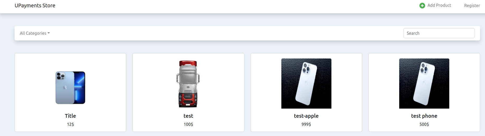

# UPayments

<h3> UPayments Task </h3>
<h5>React, Redux, Bootstrap</h5>
<br/>
# Setup and run with nodeJS(v16.16.0):
```npm i  &&  npm start``` -  ```http://localhost:3000/```
<br/>
<h6>Repo                : https://github.com/kocak-ilyas/UPaymentsTask.git</h6>
<h6>Demo                : https://upayment.netlify.app/</h6>
<hr/>
<h6>Linkedin            : https://www.linkedin.com/in/ilyaskocak</h6>
<h6>Gmail               : kocakilyas18@gmail.com </h6>
<h6>GitHub              : https://github.com/kocak-ilyas</h6>
<hr/>

